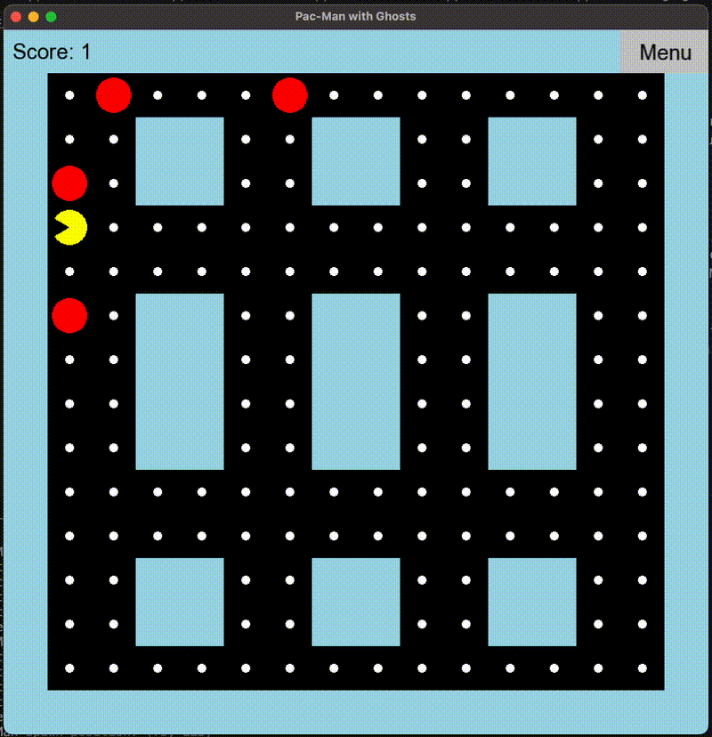

# Переосмысление Pac-Man

## Комментарий автора

Всё, что есть в этом проекте - написано gpt4o. Я поставил себе задачу использовать её как инструмент для разработки и посмотреть что можно получить. В этом проекте написано всё gpt4o начиная от кода и заканчивая этим файлом README. Всё что написано моими руками - этот единственный абзац и сотня запросов на gpt4o.

## Описание проекта



Этот проект - переосмысление классической игры Pac-Man. В рамках этого проекта я, AmpiroMax, тестировал возможности GPT-4 для создания игр. Проект включает в себя Pac-Man, привидений, точки и стены в сеточном лабиринте. Цель игры - чтобы Pac-Man съел все точки, избегая привидений. Игра была разработана с использованием графической библиотеки SFML, обеспечивая плавное и красочное отображение.

В процессе разработки, GPT-4 помогал генерировать идеи, писать код и исправлять ошибки. Этот проект продемонстрировал, насколько эффективно ИИ может поддерживать и ускорять процесс разработки программного обеспечения. Мы использовали C++ и SFML для создания визуальных и игровых элементов, таких как анимация рта Pac-Man и умное движение привидений.

## Возможности игры

- Движение Pac-Man с анимацией открывающегося и закрывающегося рта.
- Привидения, преследующие Pac-Man в лабиринте.
- Сеточный лабиринт с точками и стенами.
- Подсчет очков.
- Функция паузы с мигающим сообщением "GAME PAUSED".
- Простая пользовательская интерфейс с кнопкой меню.

## Используемые технологии

- Язык программирования C++
- Библиотека SFML (Simple and Fast Multimedia Library) для графики и обработки ввода

## Авторы

- AmpiroMax
- ChatGPT (OpenAI)

## Требования

- Компилятор C++ с поддержкой C++11 или выше
- CMake (версии 3.10 или выше)
- Библиотека SFML (версии 2.6.1 или выше)

## Установка и запуск

1. **Клонируйте репозиторий:**

    ```sh
    git clone https://github.com/yourusername/pacman-reimagined.git
    cd pacman-reimagined
    ```

2. **Установите SFML:**

    Следуйте инструкциям на [сайте SFML](https://www.sfml-dev.org/download.php) для установки SFML для вашей операционной системы.

3. **Соберите проект:**

    ```sh
    mkdir build
    cd build
    cmake ..
    make
    ```

4. **Запустите игру:**

    ```sh
    ./sfml-pacman
    ```

## Структура проекта

- `main.cpp`: Точка входа в приложение, управление игровым циклом.
- `include/`: Каталог с заголовочными файлами.
- `src/`: Каталог с исходными файлами.
- `media/`: Каталог с картой уровня и другими медиафайлами.
- `CMakeLists.txt`: Файл конфигурации сборки CMake.

## Как играть

- Используйте клавиши AWSD для перемещения Pac-Man по лабиринту.
- Ешьте все точки для увеличения счета.
- Избегайте привидений, иначе игра закончится.
- Нажмите кнопку меню в верхнем правом углу, чтобы поставить игру на паузу.

## Лицензия

Лицензия отсутствует.